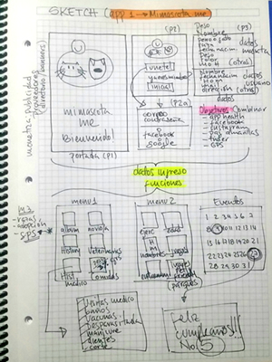

# fullstack
## ACTIVIDADES DEL CURSO FULLSTACK

Este Repositorio posee diferentes carpetas con las actividades realizadas en el curso de Fedesosft-fullstack.

A la fecha (7 de julio) se han desarrollado los siguientes temas
(cada clase llevara una carpeta si dicha clase desarrollo una actividad)

# CLASE 1
TEMAS
* Introducción
* Prototipado

## **CARPETA: Prototipado mimascota.me**

_Descripcion: Se trabajaron los 3 estados para desarrollar graficamente una aplicacion:_

---
    a. Sketch
---
    b. Wireframe 
---
    c. Mockup
---

# CLASE 2
TEMAS
* Html
* Css
* Sass

---
**CARPETAS:** 
---
**1. Mihojadevida**
---
**2. Modulosdesk**
---
_Descripcion: El proyecto era hacer un sitio web lo mas parecido al modolo enviado: www.modulosdesk.com_

---
# CLASE 3

TEMAS
* Javascript
* Angular
* Polyfills
* Node
* Npm
* Ionic
* Cobinaciones Css
* Creacion grupos y tema proyecto

**CARPETA: Gol**
---
_Descripcion: Hacer una animacion de un gol_

# CLASE 4

TEMAS
* Ecmasript (ES6)
* Angular

**CARPETA: Listado de partidos**
---
_Descripcion: Hacer un pantallazo con el listado de los partidos del mundial con sus banderas_

